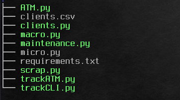

# A program to do Portfolio Cycle Management

* Structure of the project:

## Description
This project assembles all the tasks related to the cycle of portfolio management.
From creating an investment to maintain it. It operates at 8 different markets, have 4 
different types of optimizations and generates excels for each investment.
At "micro.py" we can see the program to generate a portfolio individually, where in "macro.py"
we set instructions at "clients.csv" to iterate so to scale up. Once we have our investment created
we need to maintain it, from updating the performace, change capital invested or resetting risk levels.
At "ATM.py" we have this last 3 operations to iterate through all excels of micro.py, where "maintenance.py" 
is the same script but reading the instructions of the excel.

### STEPS TO EXECUTE at MACRO LEVEL

* 1- run " pip install -r requirements.txt "
* 2- run " python clients.py " To generate with Faker library a clients.csv test file.
* 3- run " python macro.py " to iterate the excel with the instructions to generate required portfolios for each client with proper name, market to operate, risk level desired and ammount of capital to invest.
* 4- run " python maintenance.py " to do Update of the investment, Change ammount of capital invested, update risk by C-VaR or do-nothing.

### STEPS TO DO STEP BY STEP
* 1- run " python micro.py " an generate by hand a portfolio with desired attributes.
* 2- run " python ATM.py " to update, change capital invested or reset risk of all portfolios generated.

### WHAT DOES EACH FILE?
* scrap.py a set of functions to gather the information needed and filter by top 50 under criteria of sharpe ratio.
* micro.py is the individual creator of portfolios.
* macro.py runs the clients.csv file as input to do all the specified portfolios.
* ATM.py just like an ATM machine to know the state of the investment updated, reset risk or make a withdraw.
* maintenance.py same as ATM.py but in a bigger scale using clients.csv as inputs. It resets columns of values so to not repeat same operations.
* trackCLI.py & trackATM.py set of functions to Update, Change Capital and Reset Risk by C-VaR.
